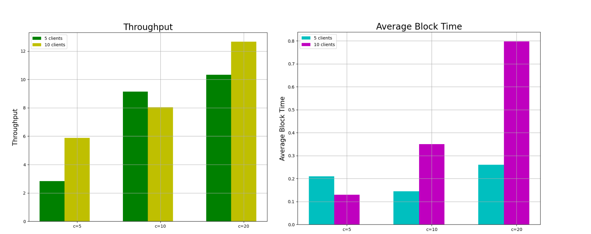

# BlockChat - Distributed Blockchain Messaging Platform

## 🚀 Overview
BlockChat is a **distributed blockchain-based messaging and transaction platform** that implements a custom Proof-of-Stake consensus mechanism. Built for the Distributed Systems course at NTUA, this system enables secure peer-to-peer messaging and cryptocurrency transactions using a custom blockchain architecture.

**Repository**: [https://github.com/evigiann/block-chat](https://github.com/evigiann/block-chat)

## 🏗️ Architecture & Technology Stack
- **Language**: Python 3
- **Framework**: Flask (REST API)
- **Consensus**: Proof-of-Stake (PoS)
- **Network**: Custom TCP/IP communication between nodes
- **Cryptography**: RSA for wallet key generation and transaction signing
- **Infrastructure**: 5-node cluster on Okeanos cloud VMs

## 💡 Key Features

### Core Components
- **Wallet Management**: Public/private key pairs for user authentication and transaction signing
- **Transaction System**: Support for both message and currency transactions with cryptographic validation
- **Blockchain Implementation**: Custom chain with hashing, block validation, and PoS consensus
- **Distributed Network**: Multi-node communication via REST API with automatic node discovery

### Transaction Types
1. **Currency Transactions**: Transfer BCC (BlockChat Coins) between users with 3% fee
2. **Message Transactions**: Send encrypted messages charged at 1 BCC per character

### Consensus Mechanism
- **Proof-of-Stake**: Validator selection based on staked BCC amount
- **Lottery System**: Nodes receive lottery tickets proportional to their stake
- **Deterministic Validation**: Uses previous block hash as random seed for fairness

## 📊 Experimental Results

### Performance Metrics
**Setup**: for 5/10 nodes, staking = 10 BCC and block capacities of 5/10/20 we have :

### Key Findings
- **Higher block capacity** → **Increased throughput** but longer block times
- **More nodes** → **Better throughput** with increased latency
- **Fairness** → Nodes with higher stakes mine proportionally more blocks

## 🛠️ Technical Skills Demonstrated
- Distributed Systems Design
- Blockchain Architecture & Consensus Algorithms
- Cryptography (RSA, Hashing, Digital Signatures)
- REST API Development with Flask
- Network Programming & Multi-node Communication
- Performance Testing & Optimization

